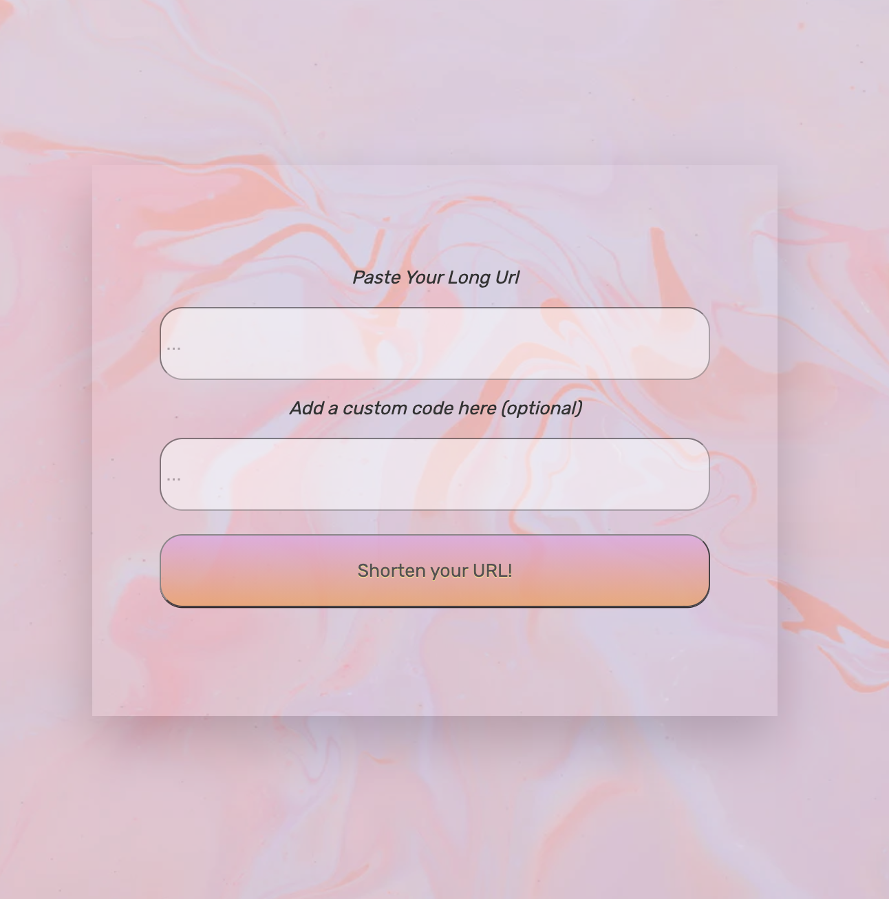
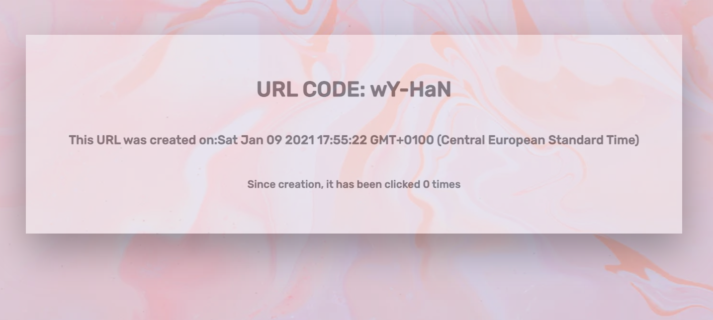

  
  
 

# GET SHORTY

A full stack React App written in TypeScript with a Node/Express Server & MongoDB database (MERN STACK)

Users are able to paste long URL's into the form provided and are able to input a custom URL if they want to!

You are then provided with an easy to use, customisable short URL you can share with whoever you like.

Users can also get more information about their short URL, including: when the URL was created, when it was last accessed and how many times it has been clicked.

# How to Use

- Step 1: Clone the repo ☝🏼
- Step 2: `cd client && npm install`
- Step 3: `cd server && npm install`
- Step 3: Navigate to the client and hit `npm start`
- Step 4: Navigate to the server and hit `node index.js`
- Step 5: Create all the short URLs you want and need!

# Testing

- Front-end Testing: `cd client && npm test`
- Back-end Testing: `cd server && npm test`

## Tech Stack

- [React](https://reactjs.org/)
- [TypeScript](https://www.typescriptlang.org/)
- [MongoDB](https://www.mongodb.com/)
- [Mongoose](https://mongoosejs.com/)
- [Node.JS](https://nodejs.org/en/)
- [Express](https://expressjs.com/)

## Author

- Ritam Verma - [GitHub](https://github.com/ritammv) - [LinkedIn](https://www.linkedin.com/in/ritammv)
